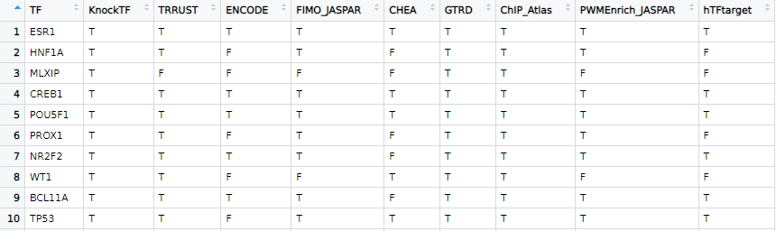
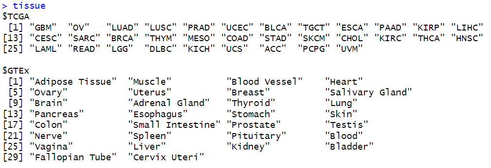
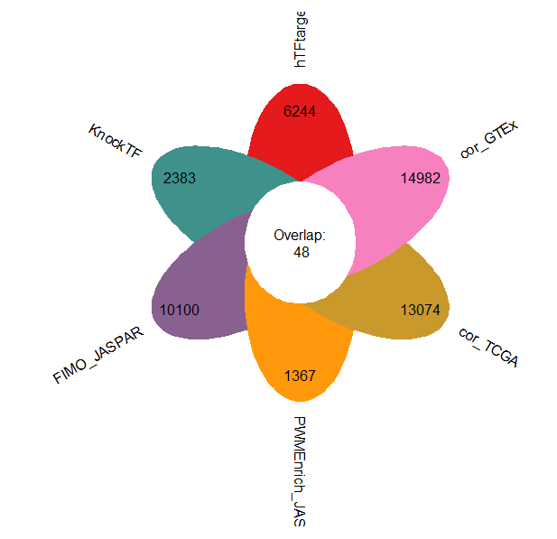
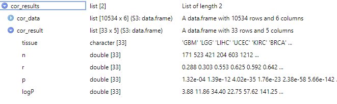
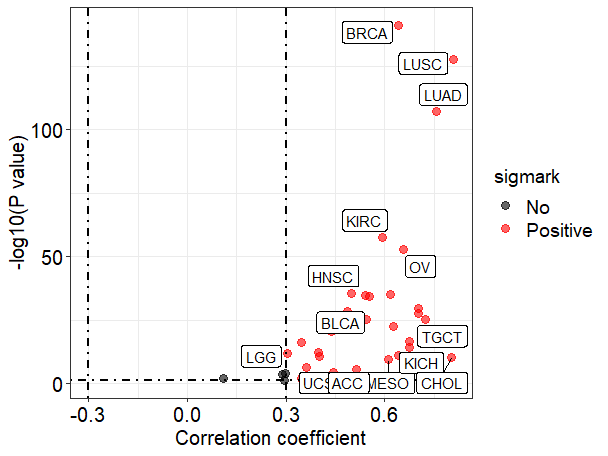
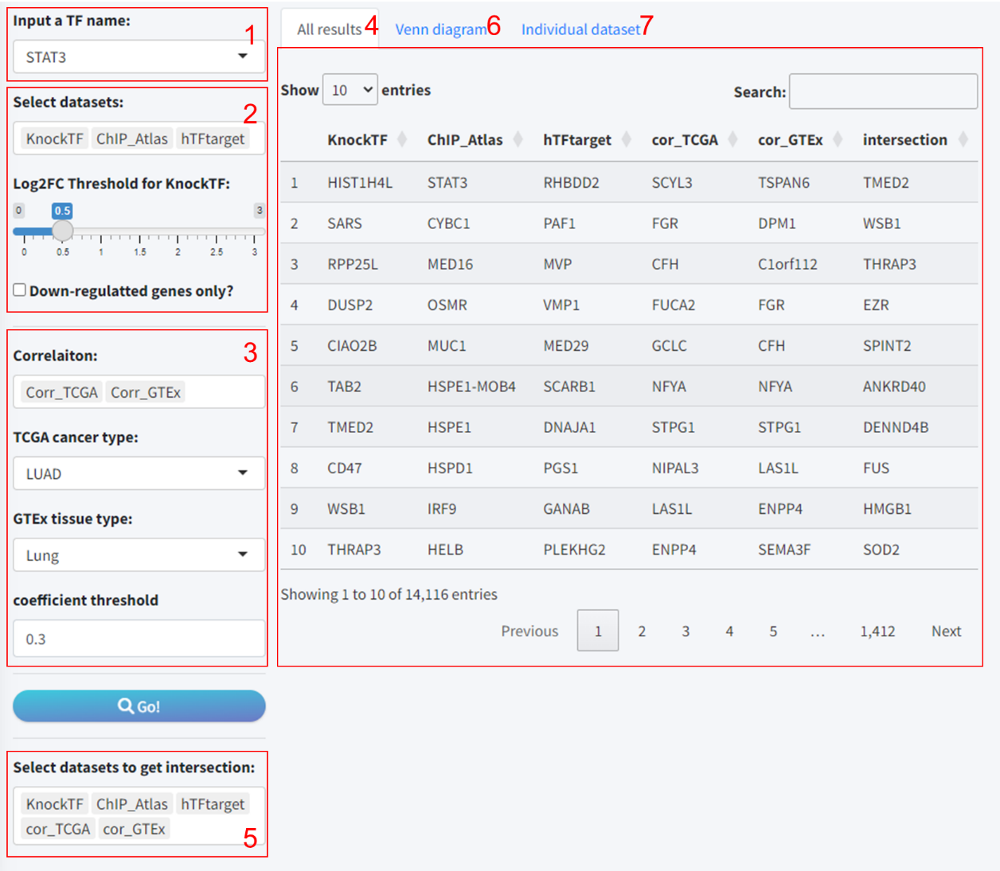
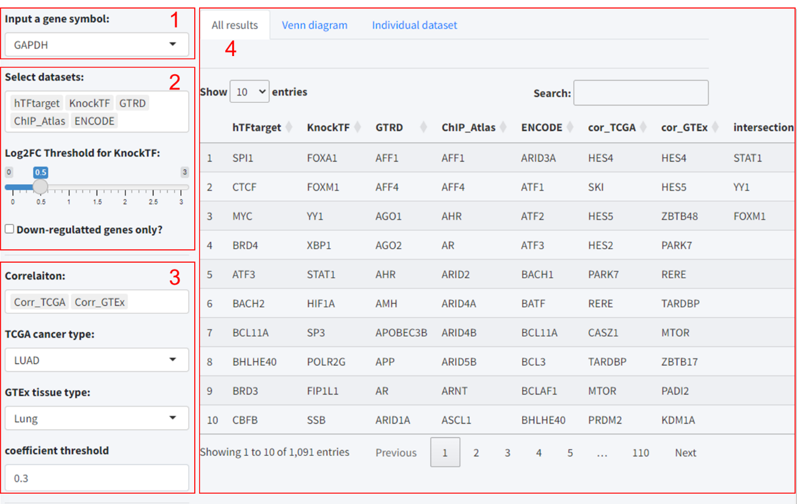
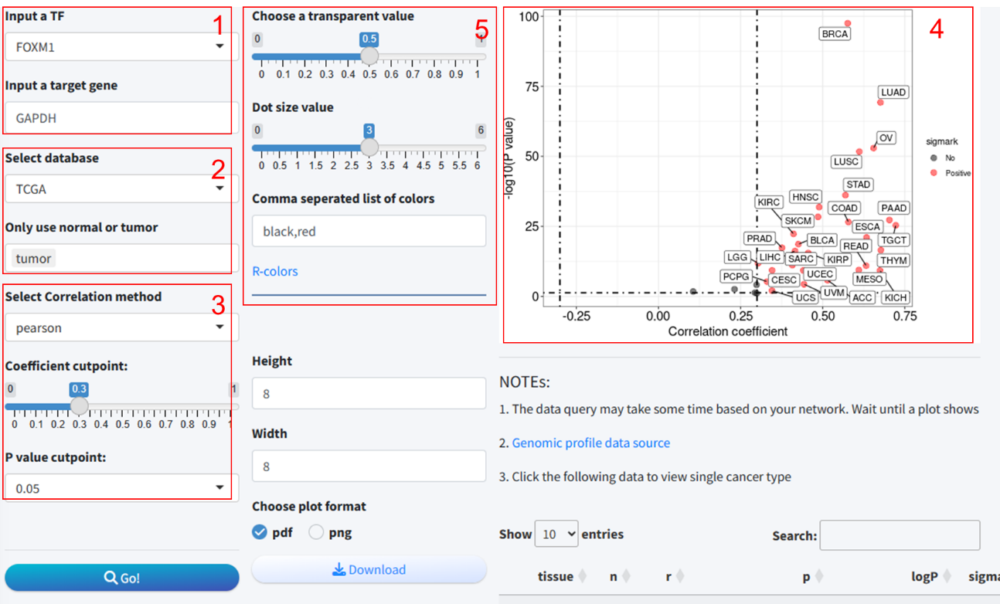
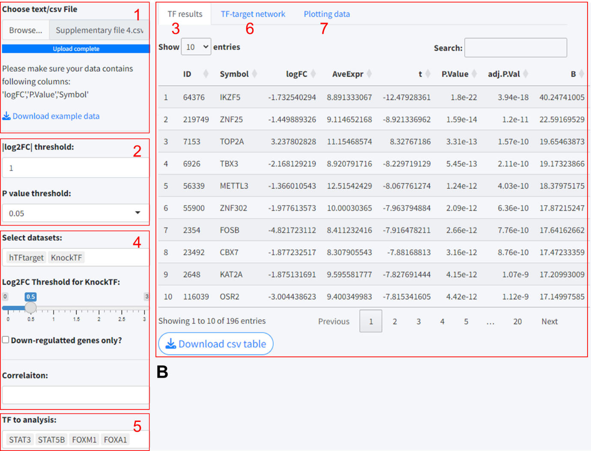

<https://www.jingege.wang/tf-target-finder-an-r-web-application-and-package-bridging-multiple-predictive-models-for-decoding-transcription-fac-tor-target-interactions/>

Transcription Factor Target Finder (TFTF) is an R package designed for predicting transcription factor target genes and predicting upstream transcription factors of target genes. There are currently many online tools for predicting transcription factor target genes, such as hTFTarget, KnockTF, CHEA, TRRUST, GTRD, and ChIP Atlas, which are based on Chip-seq high-throughput data, transcriptional profiling data from knockdown/knockout experiments, or motif sequences. Our aim is to fully utilize the prediction results from these online tools and combine them with correlation analysis to maximize the reliability of the predicted transcription factor-target gene regulatory relationships.

# 1、 Related online tools and database information

| **Dataset**  | **link**                                   | **description**                                                                                                                                                                                                                       |
|--------------|--------------------------------------------|---------------------------------------------------------------------------------------------------------------------------------------------------------------------------------------------------------------------------------------|
| hTFtarget    | <https://guolab.wchscu.cn/hTFtarget/>      | This database aggregates data from various transcription factor regulation studies, including experimental evidence and prediction results of transcription factor-target gene relationships.                                         |
| KnockTF      | <https://bio.liclab.net/KnockTF/index.php> | KnockTF is based on data from transcription factor knockout experiments, providing information on the regulation of gene expression by transcription factors, aiding in understanding transcription factor functions and networks.    |
| ENCODE       | <https://www.encodeproject.org/>           | The ENCODE project provides extensive genomic functional annotation data, including transcription factor binding sites, chromatin accessibility regions, and gene regulatory elements.                                                |
| CHEA         | <https://maayanlab.cloud/chea3/>           | The CHEA database offers transcription factor-target gene relationships based on shared promoter sequences, supporting enrichment analysis and construction of transcriptional regulatory networks.                                   |
| TRRUST       | <https://www.grnpedia.org/trrust/>         | TRRUST curates a large amount of transcription factor-target gene interaction data from literature, providing reliable information on transcription factor regulation relationships.                                                  |
| GTRD         | <https://gtrd.biouml.org/>                 | GTRD collects transcription factor binding site data from ChIP-seq experiments, providing information on  transcription factor binding in the genome.                                                                                 |
| ChIP_Atlas   | <https://chip-atlas.org/>                  | ChIP-Atlas integrates a large amount of publicly  available ChIP-seq data, providing information on  transcription factor binding sites and regulation in different cells and tissues.                                                |
| JASPAR       | <https://jaspar.genereg.net>               | JASPAR is an authoritative transcription factor binding site database, providing binding sequence data for various species, used for predicting transcription factor DNA binding preferences and regulatory effects.                  |
| TCGA         | <https://portal.gdc.cancer.gov/>           | The Cancer Genome Atlas (TCGA) is a global collaborative project aimed at advancing cancer research and diagnosis by analyzing genomic, epigenomic, and clinical data from various cancer samples.                                    |
| GTEx         | <https://www.gtexportal.org/>              | The Genotype-Tissue Expression (GTEx) project is a comprehensive research initiative aimed at exploring patterns and variations in gene expression across various human tissues to enhance our understanding of gene function.        |
| CCLE         | <https://sites.broadinstitute.org/ccle/>   | The Cancer Cell Line Encyclopedia (CCLE) is a rich resource database providing molecular characterization data from various cancer cell lines, serving as a valuable reference and resource for cancer research and drug development. |

# 2、 Data source

| **Dataset**  | **link**                                                                                     |
|--------------|----------------------------------------------------------------------------------------------|
| hTFtarget    | https://guolab.wchscu.cn/hTFtarget/api/chipseq/targets/tf                                    |
| KnockTF      | https://bio.liclab.net/KnockTFv2/public/download_anno/knocktf_v2_main_human.txt              |
| ENCODE       | https://maayanlab.cloud/static/hdfs/harmonizome/data/encodetfppi/gene_attribute_edges.txt.gz |
| CHEA         | https://maayanlab.cloud/static/hdfs/harmonizome/data/cheappi/gene_attribute_edges.txt.gz     |
| TRRUST       | https://www.grnpedia.org/trrust/data/trrust_rawdata.human.tsv                                |
| GTRD         | https://gtrd20-06.biouml.org/bioumlweb/\#                                                    |
| ChIP_Atlas   | https://chip-atlas.dbcls.jp/data/hg38/target/(TF name).tsv                                   |
| JASPAR motif | https://jaspar.elixir.no/downloads/\#pfm_vertebrates                                         |
| TCGA         | https://toil-xena-hub.s3.us-east-1.amazonaws.com/download/tcga_rsem_isoform_tpm.gz           |
| GTEx         | https://toil-xena-hub.s3.us-east-1.amazonaws.com/download/gtex_rsem_isoform_tpm.gz           |
| CCLE         | https://data.broadinstitute.org/ccle/CCLE_DepMap_18Q2_RNAseq_RPKM_20180502.gct               |

# 3、 Algorithm for predicting transcription factor target genes based on motif

## 3.1 FIMO

FIMO (Find Individual Motif Occurrences) is a tool used to identify individual motif occurrences within DNA sequences, enabling the recognition of transcription factor binding sites and other functional DNA elements.

## 3.2 PWMEnrich

[PWMEnrich](https://bioconductor.org/packages/release/bioc/html/PWMEnrich.html) (Position Weight Matrix Enrichment Analysis) is an R package for analyzing the enrichment of features such as promoter regions and transcription factor binding sites in genomic sequence data, utilizing a Position Weight Matrix (PWM) model for the identification and quantification of transcription factor binding sites.

# 4、 R package installation and basic function introduction

## 4.1 Installing TFTF from GitHub

devtools::install_github("WangJin93/TFTF")

## 4.2 Introduction to Data and Basic Functions

View the list of transcription factors included in this R package and their coverage across all datasets. We only include transcription factors that are present in at least 2 datasets out of nine, resulting in a total of 1575 transcription factors.
```R
tf_list
```


\# View correlation analysis organization types
```R
tissue
```


destination description Predict the target genes of Transcription Factor in multiple TF-target prediction databases and correlation analysis.
```R
predict_target(

datasets = c("hTFtarget", "KnockTF", "FIMO_JASPAR", "PWMEnrich_JASPAR", "ENCODE",

"CHEA", "TRRUST", "GTRD", "ChIP_Atlas"),

tf = "STAT3",

TCGA_tissue = "COAD",

GTEx_tissue = "Colon",

cor_DB = c("TCGA", "GTEx"),

cor_cutoff = 0.3,

FIMO.score = 10,

PWMEnrich.score = 10,

cut.log2FC = 1,

down.only = T,

app = F

)
```
Predict the upstream Transcription Factors regulating user inputted gene in multiple TF-target prediction databases and correlation analysis.
```R
predict_TF(

datasets = c("hTFtarget", "KnockTF", "FIMO_JASPAR", "PWMEnrich_JASPAR", "ENCODE",

"CHEA", "TRRUST", "GTRD", "ChIP_Atlas"),

target = "GAPDH",

TCGA_tissue = "COAD",

GTEx_tissue = "Colon",

cor_DB = c("TCGA", "GTEx"),

cor_cutoff = 0.3,

FIMO.score = 10,

PWMEnrich.score = 10,

cut.log2FC = 1,

down.only = T,

app = F

)
```
Intersection analysis and visualization of prediction results
```R
Results \<-predict_target(datasets=c("hTFtarget","KnockTF","FIMO_JASPAR",

"PWMEnrich_JASPAR"),

cor_DB = c("TCGA","GTEx"),

tf = "STAT3")

results_inter \<- intersections(results)

plot_venn(results_inter)
```


Correlation analysis between TF and target gene in pan-tissue in "TCGA", "GTEx" or "CCLE" databases.
```R
cor_results \<- pantissue_cor_analysis(

Gene1 = "FOXM1",

Gene2 = "GAPDH",

data_source = "TCGA",

type = c("normal", "tumor"),

cor_method = "pearson"

)
```


Visualization of pan-tissue correlation analysis using ggplot2.
```R
viz_cor_results(cor_results,

values = c("black","red"))
```


# 5、 Introduction to the operation of Shiny APP visualization interface

The R package has a built-in app that can implement all the functions of the R package, visualize the operation interface, and require the necessary packages to be installed in order to run (shiny, DT, graph, ggraph, shinyWidgets, bs4Dash, tidygraph).
```R
TFTF_app()
```
\#In addition, you can also access the app through the following link: <https://jingle.shinyapps.io/TF_Target_Finder/>。

## 5.1 Module 1: Procedures for the prediction of the target genes of TF

This systematic approach enables a thorough analysis of TF-target gene interactions, bolstering the robustness of predictions by harnessing the combined strength of multiple dataset intersections. The procedural steps are as follows:

-   **Input a TF name**: Users initiated the process by selecting a TF of interest from a dropdown list.
-   **Select TF-Target datasets:** Then choose the TF-Target datasets to include in the analysis. Notably, if “KnockTF” was selected, an additional interface element appeared: a slider for setting the log2 fold-change (Log2FC) threshold. This specification is necessary as KnockTF predictions are based on differential gene expression data following TF knockdown or knockout.
-   **Select correlation datasets (optional):** Users can further enhance the accuracy of predictions based on the correlation analysis results of TF and target gene expression in different tissues based on TCGA and GTEx database. Also, the threshold for correlation coefficient is set to 0.3.
-   **Results:** By clicking the “Go” button, users commenced the predictive analysis. After a short wait, the prediction outcomes were displayed on the “All results” tab, which encompassed individual tool results and the intersected findings.
-   **Intersection selection:** Given that some tools may yield sparse predictions or lack data, we provided an option box to select well-predicted datasets for intersection analysis, which is visualized through a Venn diagram.
-   **Visualize intersections:** The “Venn diagram” tab allowed for the visualization of overlapping predictions across multiple tools using Venn or petal diagrams.
-   **Individual dataset review:** The “Individual dataset” tab enabled viewing and downloading detailed information for each tool’s predictive results.



## 5.2 Module 2: Procedures for the prediction of upstream TFs of target genes

This integrated approach, combining gene expression correlation analysis with multi-dataset intersection, was designed to ensure a comprehensive and reliable prediction of TF-target gene interactions. The operational steps are detailed below:

-   **Input a target gene symbol:** Such as GAPDH.
-   **Select datasets:** Participants then chose the predictive tools to include in the analysis. Notably, if “KnockTF” was selected, an additional interface element appeared: a slider for setting the log2 fold-change (Log2FC) threshold, along with a checkbox to include only downregulated genes. This specification is necessary as KnockTF predictions are based on differential gene expression data following TF knockdown or knockout.
-   **Select correlation datasets (optional):** Users can further enhance the accuracy of predictions based on the correlation analysis results of TF and target gene expression in different tissues based on TCGA and GTEx database. Also, the threshold for correlation coefficient is set to 0.3.
-   **Results:** Similar to Module 1, the predicted results were displayed on the “All results” tab. Also, user can select datasets with robust predictions for intersection analysis.



## 5.3 Module 3: Pan-tissue correlation analysis between the expression of predicted TF-target pair

In this module, we utilized data from three publicly available databases to analyze the expression correlation of TF-target pairs across various tissue types. The integration of these analyses enables a comprehensive assessment of the expression relationship between the TFs and their potential target genes in a context-specific manner. The methodological steps are detailed as follows:

-   **TF and target gene input:** The user begins by selecting a transcription factor and entering the symbol for the target gene.
-   **Database selection:** The database(s) for analysis are chosen from among TCGA, GTEx, and CCLE. Notably, upon selecting TCGA, a popup menu appears, offering the user the option to include tumor data exclusively.
-   **Correlation analysis parameters:** Parameters for correlation analysis are set, including the selection of the analysis method and the establishment of thresholds for the correlation coefficient and p-value.
-   **Correlation results and scatter plot:** Data retrieval and correlation analysis are initiated by clicking the “Go” button. Subsequently, the results of the correlation analysis are presented, along with a scatter plot illustrating the expression correlation.
-   **Plotting parameter:** Options are provided to adjust parameters relevant to the scatter plot visualization.
-   **Detailed scatter plot:** Clicking on a row within the results table prompts a popup window that displays a detailed scatter plot for the expression of the two genes within a single tissue type.



## 5.4 Module 4: TF-targets regulation network analysis

The module was designed to predict the target genes of transcription factors (TFs) of interest based on gene differential expression analysis results uploaded by the user, utilizing multiple TF prediction databases, and to visualize the regulatory network. This module thus facilitates the elucidation of potential regulatory relationships by integrating user data with established TF prediction resources, supporting the discovery of novel insights into gene regulatory networks. The steps for utilizing this module are as follows:

-   **Data upload:** Users upload their gene expression differential analysis results. It is important to ensure that the column names in the uploaded file are consistent with those in the example data provided.
-   **Differential gene selection criteria:** Set the thresholds for selecting differentially expressed genes, specifically the log2 fold change (log2FC) and p-value.
-   **TF different expression result:** The ‘TF result’ page will exhibit the differential analysis results of TFs extracted from the user’s uploaded data.
-   **Datasets selection:** Choose the predictive tools to be included in the analysis for identifying TF-target gene relationships.
-   **TF List Update:** Upon input completion, the ‘TF to analysis’ input field automatically updates with a list of TFs. This list is generated based on the intersection of differentially expressed genes from the uploaded results and the TFs contained within the chosen predictive tools.
-   **Network Visualization:** Clicking the ‘Go’ button starts the predictive analysis process. After the analysis is complete, a network diagram is generated. Note that some TFs may not display target genes in the network diagram if no target genes are identified after intersecting the results from multiple tools. In such cases, it may be beneficial to reduce the number of tools included in the analysis to obtain more extensive information.
-   **Plotting Data Interface:** The ‘Plotting data’ interface will present the predicted results for TF-target genes.



# 6、 Source code

https://github.com/WangJin93/TFTF

# 7、 Citation

Under review

# 8、 Feedback and suggestions

Email: [jin.wang93@outlook.com](mailto:jin.wang93@outlook.com)
